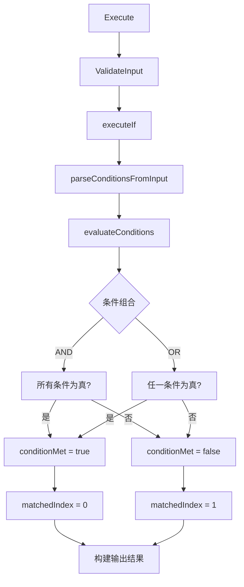

# IF 条件节点参考文档

## 概述

IF 条件节点（`ConditionCheckActivity`）是 N8N to Temporal 转换系统中的核心逻辑控制节点，用于根据设定的条件规则进行分支判断，实现工作流的条件分支逻辑。

**架构更新**: 该节点现在使用统一的 `ExpressionEvaluator`（位于 `base.go` 中），提供完整的 N8N 表达式兼容性和工作流上下文管理功能。

## 节点信息

- **节点ID**: `condition_check`
- **节点名称**: `IF Condition`
- **节点类型**: `LOGIC.conditionCheck`
- **版本**: `1.0.0`
- **分类**: `logic`
- **图标**: `🔀`

## 功能特性

### ✨ 核心功能
- 支持多条件组合判断（AND/OR 逻辑）
- 兼容 N8N 表达式语法
- 支持严格和松散类型比较
- 完整的操作符支持
- 跨节点数据引用
- 向后兼容接口

### 🔧 支持的表达式格式

#### 1. 当前节点数据引用
```n8n
={{ $json.domain }}
={{ $json.status }}
={{ $json.priority }}
```

#### 2. 直接值表达式
```n8n
=www.baidu.com
=12345
=true
```

#### 3. 跨节点数据引用
```n8n
={{ $('NodeName').item.json.field }}
={{ $('Code in Python (Beta)').item.json["@type"] }}
```

#### 4. 普通值
```n8n
some text
123
true
```

## 参数配置

### 输入参数结构

```json
{
  "nodeId": "unique-node-id",
  "nodeName": "If",
  "nodeType": "LOGIC.conditionCheck",
  "inputData": {
    "domain": "www.baidu.com",
    "status": "active"
  },
  "parameters": {
    "conditions": {
      "options": {
        "caseSensitive": true,
        "leftValue": "",
        "typeValidation": "strict",
        "version": 2
      },
      "conditions": [
        {
          "id": "condition-1",
          "leftValue": "={{ $json.domain }}",
          "rightValue": "=www.baidu.com",
          "operator": {
            "type": "string",
            "operation": "equals",
            "name": "filter.operator.equals"
          }
        }
      ],
      "combinator": "and"
    },
    "options": {}
  },
  "workflowId": "workflow-id",
  "executionId": "execution-id"
}
```

### 条件配置详解

#### 条件对象 (Condition)
```json
{
  "id": "unique-condition-id",
  "leftValue": "左侧值（支持表达式）",
  "rightValue": "右侧值（支持表达式）",
  "operator": {
    "type": "string|number",
    "operation": "equals|not_equals|contains|...",
    "name": "可选的操作符名称"
  }
}
```

#### 组合器 (Combinator)
- `and`: 所有条件都必须为真
- `or`: 任一条件为真即可

## 支持的操作符

### 字符串操作符
| 操作符 | 别名 | 描述 | 示例 |
|--------|------|------|------|
| `equals` | `==` | 等于 | `left == right` |
| `not_equals` | `!=` | 不等于 | `left != right` |
| `contains` | - | 包含 | `"hello".contains("ell")` |
| `not_contains` | - | 不包含 | `"hello".not_contains("world")` |
| `starts_with` | - | 开始于 | `"hello".starts_with("he")` |
| `ends_with` | - | 结束于 | `"hello".ends_with("lo")` |
| `greater_than` | `>` | 大于 | `"b".greater_than("a")` |
| `greater_than_or_equal` | `>=` | 大于等于 | `"b".greater_than_or_equal("a")` |
| `less_than` | `<` | 小于 | `"a".less_than("b")` |
| `less_than_or_equal` | `<=` | 小于等于 | `"a".less_than_or_equal("b")` |
| `is_empty` | - | 为空 | `"".is_empty()` |
| `is_not_empty` | - | 不为空 | `"hello".is_not_empty()` |

### 数字操作符
| 操作符 | 别名 | 描述 | 示例 |
|--------|------|------|------|
| `equals` | `==` | 等于 | `10 == 10` |
| `not_equals` | `!=` | 不等于 | `10 != 5` |
| `greater_than` | `>` | 大于 | `10 > 5` |
| `greater_than_or_equal` | `>=` | 大于等于 | `10 >= 10` |
| `less_than` | `<` | 小于 | `5 < 10` |
| `less_than_or_equal` | `<=` | 小于等于 | `5 <= 5` |

### 布尔操作符
| 操作符 | 别名 | 描述 | 示例 |
|--------|------|------|------|
| `equals` | `==` | 等于 | `true == true` |
| `not_equals` | `!=` | 不等于 | `true != false` |

## 类型验证模式

### Strict (严格模式)
- 要求数据类型完全匹配
- 字符串只能与字符串比较
- 数字只能与数字比较
- 布尔值只能与布尔值比较

### Loose (松散模式) - 默认
- 自动类型转换
- 尝试将值转换为数字进行比较
- 失败时转换为字符串比较

## 执行流程



## 输出格式

### 成功输出
```json
{
  "matchedIndex": 0,
  "output": {
    "conditionMet": true,
    "conditions": [...],
    "combinator": "and",
    "inputData": {...},
    "evaluationTime": 1698623456
  },
  "conditions": [...],
  "combinator": "and",
  "conditionMet": true,
  "inputData": {...}
}
```

### 错误输出
```json
{
  "success": false,
  "error": "条件评估失败: 解析左值失败: 字段路径 'domain' 中缺少 'domain'"
}
```

## 使用示例

### 示例 1: 域名匹配检查
```json
{
  "conditions": {
    "conditions": [
      {
        "id": "domain-check",
        "leftValue": "={{ $json.domain }}",
        "rightValue": "=www.baidu.com",
        "operator": {
          "type": "string",
          "operation": "equals"
        }
      }
    ],
    "combinator": "and"
  }
}
```

### 示例 2: 复合条件检查
```json
{
  "conditions": {
    "conditions": [
      {
        "id": "domain-check",
        "leftValue": "={{ $json.domain }}",
        "rightValue": "=www.baidu.com",
        "operator": {
          "type": "string",
          "operation": "equals"
        }
      },
      {
        "id": "type-check",
        "leftValue": "={{ $json.type }}",
        "rightValue": "=active",
        "operator": {
          "type": "string",
          "operation": "equals"
        }
      }
    ],
    "combinator": "and"
  }
}
```

### 示例 3: 跨节点数据引用
```json
{
  "conditions": {
    "conditions": [
      {
        "id": "python-result-check",
        "leftValue": "={{ $('Code in Python (Beta)').item.json[\"@type\"] }}",
        "rightValue": "=false",
        "operator": {
          "type": "string",
          "operation": "notEquals"
        }
      }
    ],
    "combinator": "or"
  }
}
```

## API 接口

### 主要方法

#### Execute(ctx, input) (*ActivityOutput, error)
执行节点的入口方法，调用基类的执行包装器。

#### ValidateInput(input) error
验证输入参数的完整性和正确性。

#### ExecuteIf(ctx, input) (map[string]interface{}, error)
向后兼容的执行接口。

### 内部方法

#### parseConditionsFromInput(parameters []byte) (*ConditionsData, error)
从 JSON 字节数据解析条件配置。

#### evaluateConditions(conditions, inputData, combinator) (bool, error)
评估所有条件并根据组合器计算最终结果。

#### evaluateSingleCondition(condition, inputData) (bool, error)
评估单个条件的真值。

#### parseValue(value, inputData) (interface{}, error)
解析条件值，支持 N8N 表达式语法。

#### evaluateN8NExpression(expression, inputData) (interface{}, error)
评估 N8N 表达式并返回实际值。

#### compareValues(left, right, operator, typeValidation) (bool, error)
比较两个值，支持多种操作符和类型验证模式。

## 错误处理

### 常见错误类型

1. **参数验证错误**
   - `缺少parameters参数`
   - `缺少conditions参数`
   - `条件列表不能为空`

2. **条件解析错误**
   - `node if parameters error: <JSON解析错误>`
   - `conditions参数格式错误，应为对象`

3. **表达式解析错误**
   - `解析左值失败: <具体错误>`
   - `解析右值失败: <具体错误>`
   - `无效的节点引用表达式: <表达式>`

4. **字段提取错误**
   - `字段路径 'path' 中缺少 'field'`
   - `字段路径 'path' 在 'field' 处不是对象`

5. **操作符错误**
   - `不支持的操作符: <操作符>`
   - `不支持的严格比较类型: <类型>`

## 性能考虑

- 使用 Sonic 库进行高性能 JSON 序列化/反序列化
- 字段路径解析采用简单分割算法，性能较好
- 条件评估采用短路逻辑，AND 遇到 false 立即返回，OR 遇到 true 立即返回
- 类型转换在松散模式下进行，可能有一定的性能开销

## 最佳实践

1. **条件设计**
   - 保持条件简单明确
   - 合理使用 AND/OR 组合器
   - 优先使用严格模式以确保类型安全

2. **表达式使用**
   - 优先使用 `$json.field` 格式引用当前节点数据
   - 跨节点引用时确保节点名称正确
   - 直接值使用 `=value` 格式

3. **错误处理**
   - 检查所有必需参数
   - 提供有意义的错误信息
   - 使用适当的默认值

4. **性能优化**
   - 避免过于复杂的嵌套表达式
   - 合理设置条件顺序，将最可能失败的条件放在前面（AND 逻辑）
   - 使用适当的数据类型以减少类型转换开销

## 版本历史

### v1.0.0
- 初始版本
- 支持基本的条件判断功能
- N8N 表达式语法支持
- 严格和松散类型验证
- 完整的操作符支持